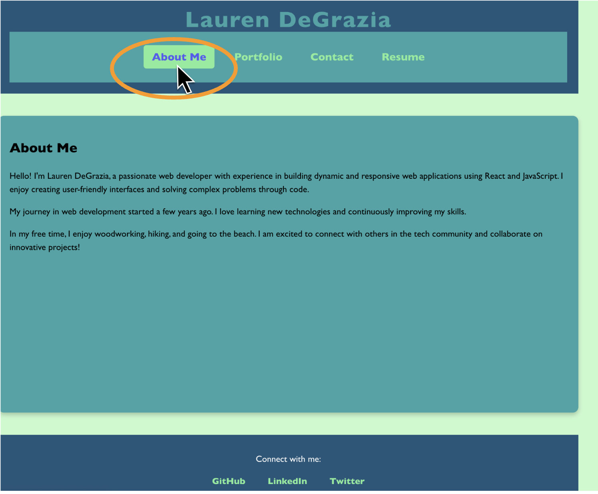
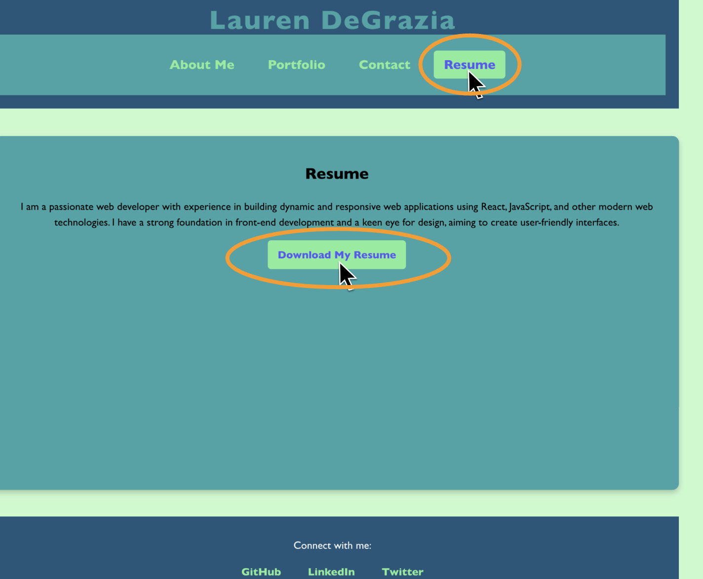

# Lauren DeGrazia’s Portfolio

## Description

**Thank you for taking the time to check out my hard work!** 

Follow the navigation bar links to learn more about Lauren DeGrazia & her work. 

## Table of Contents

- [Usage](#usage)
- [Contributors](#contributors)
- [License](#license)
- [Questions](#questions)

## Usage

### [Click here to visit Lauren DeGrazia’s portfolio](https://ldegrazportfolio.netlify.app/)

#### Explore the website:

1. After clicking the link above, You will see the “about me” page of the portfolio. 

    

2. Use the navigation bar to explore Lauren DeGrazia’s portfolio
- The project’s GitHub Repo link will appear as you hover over the picture

    
    

- The link found in the “placeholder” projects will take you to Lauren DeGrazia’s GitHub profile

    
    

3. Click “contact” to reach out with any questions, comments, or concerns. 

    

- You will see an error message for an incomplete email address & an empty message-field. 

    
    

4. Read more about Lauren DeGrazia’s accomplishments & strengths by clicking the resume tab.
- You can download a PDF of Lauren DeGrazia’s resume by clicking “download my resume”

    

5. If you would like more information about Lauren DeGrazia, scroll to the portfolio footer for GitHub, Linkedin, & Twitter links

    

## Contributors

- [Lauren DeGrazia](https://github.com/LDegraz/employee-db.git) - Project Creator
- [react](https://www.npmjs.com/package/react) - A JavaScript library for building user interfaces, which allowed me to create reusable components and manage the application's state effectively.
- [react-dom](https://www.npmjs.com/package/react-dom) - This library provided the necessary methods to interact with the DOM, enabling me to render React components in the browser.
- [react-router-dom](https://www.npmjs.com/package/react-router-dom) - A powerful routing library for React that facilitated navigation between different components and enabled the creation of a single-page application experience.
- Xpert Learning Assistant - The AI Learning Assistant for support and guidance throughout the bootcamp.
- Lesley Vaden - T.A., providing guidance and support throughout the assignment.
- Kevin Ferguson: Instructor, providing guidance and support throughout the assignment.

## License

This project is licensed under the MIT license. See below for details.

### MIT License

MIT License

Copyright (c) [2025] [Lauren DeGrazia]

Permission is hereby granted, free of charge, to any person obtaining a copy
of this software and associated documentation files (the "Software"), to deal
in the Software without restriction, including without limitation the rights
to use, copy, modify, merge, publish, distribute, sublicense, and/or sell
copies of the Software, and to permit persons to whom the Software is
furnished to do so, subject to the following conditions:

The above copyright notice and this permission notice shall be included in all
copies or substantial portions of the Software.

THE SOFTWARE IS PROVIDED "AS IS", WITHOUT WARRANTY OF ANY KIND, EXPRESS OR
IMPLIED, INCLUDING BUT NOT LIMITED TO THE WARRANTIES OF MERCHANTABILITY,
FITNESS FOR A PARTICULAR PURPOSE AND NONINFRINGEMENT. IN NO EVENT SHALL THE
AUTHORS OR COPYRIGHT HOLDERS BE LIABLE FOR ANY CLAIM, DAMAGES OR OTHER
LIABILITY, WHETHER IN AN ACTION OF CONTRACT, TORT OR OTHERWISE, ARISING FROM,
OUT OF OR IN CONNECTION WITH THE SOFTWARE OR THE USE OR OTHER DEALINGS IN THE
SOFTWARE.

## Questions

If you have any questions, feel free to reach out!
- **GitHub:** [LDeGraz](https://github.com/LDegraz)
- **Email:** [degrazial3@gmail.com](mailto:degrazial3@gmail.com)

### How to Contact

You can contact me via email for any inquiries or feedback regarding this project. Alternatively, you can open an issue on GitHub if you encounter any problems or have suggestions for improvements. I will do my best to respond promptly!

